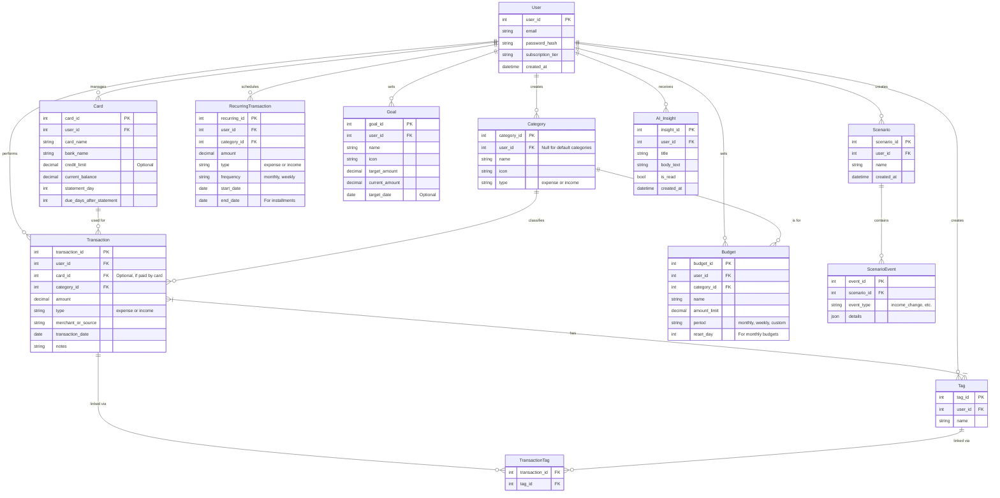

# App Concept Summary: Automated Financial Wellness (Updated)

This document provides a complete overview of the financial tracking application, from its high-level business strategy to its detailed feature set and user flows, incorporating the latest four-tier subscription model.

---

## 1. Business Model & Feature Tiers

### Business Model: Freemium

The app operates on a **Freemium** model designed for the Thai market. The goal is to attract a wide user base with a functional free tier and provide a clear, compelling upgrade path through four distinct tiers as users' financial needs mature.

- **Free Tier:** An entry point for basic expense tracking, offering a limited taste of the app's core automation.
- **Premium Tier:** The core paid offering, providing a complete, automated, real-time view of a user's entire financial health _right now_.
- **Planner Tier:** A mid-tier plan for users ready to actively plan their financial future with powerful forecasting and debt-planning tools, without AI-driven features.
- **Planner Plus Tier:** The high-end tier for power users, focused on optimizing their future with unlimited forecasting and AI-powered guidance.

### Feature Tiers & Pricing Summary

| Feature                             | Free               | Premium (The Hub)                     | **Planner (The Forecaster)**             | Planner Plus (The Advisor)               |
| ----------------------------------- | ------------------ | ------------------------------------- | ---------------------------------------- | ---------------------------------------- |
| Manual & Automated Expense Tracking | ✓                  | ✓                                     | ✓                                        | ✓                                        |
| E-Slip & Receipt Scanning           | Limited (20/month) | Unlimited                             | Unlimited                                | Unlimited                                |
| Budget Creation ("Wallets")         | Limited (2)        | Unlimited                             | Unlimited                                | Unlimited                                |
| Data Export (CSV)                   |                    | ✓                                     | ✓                                        | ✓                                        |
| Standard Reporting & Analytics      |                    | ✓                                     | ✓                                        | ✓                                        |
| **Integrated Debt Payoff Planner**  |                    |                                       | ✓                                        | ✓                                        |
| **Scenario/Future Planning**        |                    |                                       | **Limited (3 Scenarios)**                | **Unlimited**                            |
| AI-Powered Insights & Coaching      |                    |                                       |                                          | ✓                                        |
| Priority Support                    |                    |                                       |                                          | ✓                                        |
| **Price**                           | **Free**           | **99 THB/month**   or 799 THB/year | **149 THB/month**   or 1,199 THB/year | **199 THB/month**   or 1,499 THB/year |

---

## 2. Target User Personas

### Persona 1: Ploy (The Everyday Tracker)

A 28-year-old professional in Bangkok who is tech-savvy but lacks clarity on her monthly spending. Her goal is to **gain visibility and control** over her daily expenses. She is the target user for the **Free** and **Premium** tiers.

### Persona 2: Anan (The Family Planner)

A 38-year-old professional with a family, mortgage, and investments. He needs more than just tracking; he wants to **optimize his finances, pay off debt efficiently, and plan for future goals**. He is the ideal user for the **Planner** or **Planner Plus** tiers.

---

## 3. Core User Flows

### A. User Onboarding Flow

The onboarding is designed to deliver the **"Aha!" Moment** within 60 seconds by guiding the user to successfully scan their first e-slip, demonstrating the app's core value immediately.

### B. Income Management Flow

Users can perform **manual entry** for one-off income or set up **recurring income** (e.g., salary) to be logged automatically. Income is clearly differentiated from expenses and visualized in a simple **Income vs. Expense** dashboard chart.

### C. The "Wallet" Budgeting Flow

This intuitive system allows users to create budgets ("Wallets") for specific categories. When a user logs a categorized expense, the amount is **automatically deducted** from the corresponding wallet, with visual progress bars and proactive alerts providing feedback.

---

## 4. Comprehensive Feature List

_(Note: Feature availability is dependent on the user's subscription tier)_

### I. Core Transaction Management

- **Comprehensive Transaction Logging:** Add, edit, and delete income/expenses.
- **Persistent Transaction History:** All transactions are saved permanently and are fully searchable.
- **Recurring Transactions:** Schedule automatic logging for recurring income and expenses.
- **Transaction Tagging:** Assign multiple custom tags for flexible reporting.

### II. Automation & Intelligence

- **Receipt & E-Slip Scanning (OCR):** Automatically extract transaction details from Thai e-slips and receipts.
- **Automatic Transaction Categorization:** Intelligently suggest categories for new transactions.

### III. Budgeting & Financial Planning

- **Envelope Budgeting System ("Wallets"):** Create virtual budgets for specific spending categories.
- **Flexible Budgeting Periods:** Set budgets for daily, weekly, monthly, or custom cycles.
- **Financial Scenario Planning:** Model the future financial impact of major life events or goals.

### IV. Account Management

- **Credit Card Management:** Track balances and set payment due dates.
- **Payment Reminders & Alerts:** Receive push notifications for upcoming bill due dates.
- **Debt Payoff Planner:** List all debts, track progress, and compare payoff strategies.
- **Custom Reporting Cycles:** Align the monthly summary with a user's salary or statement cycle.

### V. Dashboard & Reporting

- **Central Dashboard:** An at-a-glance overview of financial health with customizable widgets.
- **Key Widgets:** Include Current Balances, Spend Summaries, Recent Transactions, Spending by Category charts, and Budget Status.
- **Trend Comparison Graph:** Visually compare spending from one period to the next.
- **Secure Data Export (CSV):** Export transaction history via a secure, time-limited download link.

